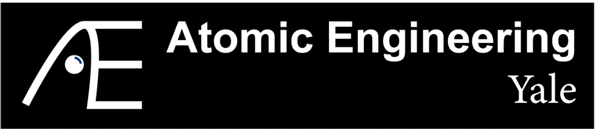

# Nion EM nhdf Utility GUI

<div align="center">
  
  &nbsp;&nbsp;&nbsp;&nbsp;
  
</div>


Author: Sebastian (Yusong, or Seb) Deng, at AtomE Lab (PI: Dr. Cong Su) at Yale University, Departmnet of Materials Science.

This project started in order to help Seb Deng (who is me) to solve some problems encountered in his day to day research when interacting with Nion (now Bruker AXS) electron microscopes. Nion utilized nhdf files to store enormous meta data in the folder. However, the common software we use on daily basis, like Nion Swift, ImageJ fails to open the images (at least I didn't find a way to). During one imaging Session, Ben (Nion Microscopist) sent me a script developed by Chris Meyer @cmeyer, cmeyer/read_nhdf.py https://gist.github.com/cmeyer/84ca01974369d9b2841ddf8f0ff212d2, in order to read the file using python scripts. Naturally, I want to expand the script from a code to a GUI for easy and quick examine of the data. Later on we expand on it a little to give it some quick data examine capability and data processing capability (to be further developed). I hope this could be helpful to our electron microscopists friends who have little experience in coding to fully utilize the potential of Nion nhdf file formats. 

The GUI is equiped with a modern graphical user interface for visualizing and managing Nion electron microscopy data files in nhdf (HDF5-based) format. Everything are designed in a similar logic as the Nion Swift software - especially in the workspace panel management perspective. Users who are familiar witth Nion Swift 16+ shall be able to use this GUI seamlessly. 

*This project is primarily designed by Seb Deng, and Claude Code performs the majority of coding. Cheers to Claude Code on the excellent capability.

Please send any bug or issue you noticed to sebastian.deng@yale.edu and I will try to address the issue to the best of my capabilities. Please forgive me that I am not a professional software engineer. Please also let me know if you want to contribute (actual code or ideas). 

**Have FUN!!!**
## Features

- **Multi-Format Support**: Read both Nion nhdf and Gatan DM3/DM4 files
- **Free-Tiling Workspace** (Default): Nion Swift-style panel management with flexible splitting
- **Drag & Drop Support**: Drag EM files from file browser or system directly to panels
- **Multi-file Preview**: Open and compare multiple files simultaneously
- **Data Visualization**: View 2D images, line profiles, histograms, and multi-dimensional data
- **Metadata Browser**: Explore comprehensive metadata including calibrations, timestamps, and instrument parameters
- **Export Options**: Export data to various formats (TIFF, PNG, JPG, MP4 video, CSV, JSON)
- **Modern UI**: Clean, dark-themed interface built with PySide6 (Qt), inspired by Nion Swift
- **Scale Bar**: Automatic scale bar overlay with calibrated units
- **Frame Navigation**: Playback controls for multi-frame sequences with video export

## Installation

### Prerequisites

- [Miniconda](https://docs.conda.io/en/latest/miniconda.html) or [Anaconda](https://www.anaconda.com/products/distribution)

### Setup

1. Clone the repository:
   ```bash
   git clone https://github.com/SebDeng/Nion-EM-nhdf-Utility-GUI.git
   cd Nion-EM-nhdf-Utility-GUI
   ```

2. Create and activate the conda environment:
   ```bash
   conda create -n nhdf-gui python=3.11 -y
   conda activate nhdf-gui
   ```

3. Install dependencies:
   ```bash
   pip install -r requirements.txt
   ```

## Usage

### Default Mode (Free-Tiling Workspace)
```bash
conda activate nhdf-gui
python main.py [file.nhdf]
```

### Simple Mode (Single Panel)
```bash
conda activate nhdf-gui
python main.py --simple [file.nhdf]
```

### Workspace Features
The application runs in workspace mode by default, where you can:

- **Load Files via Drag & Drop**:
  - Drag nhdf files from the file browser panel to any workspace panel
  - Drag files directly from your system (Finder/Explorer) to panels
  - Panels highlight in blue when hovering with a valid file
- **Split Panels**:
  - Horizontal split: `Ctrl+H` or View → Workspace → Split Horizontally
  - Vertical split: `Ctrl+V` or View → Workspace → Split Vertically
- **Close Panels**: Click the ✕ button on any panel (minimum 1 panel required)
- **Layout Presets**: View → Workspace → Layout Presets
  - Single Panel
  - 2 Panels Horizontal/Vertical
  - 4 Panel Grid (2x2)
- **Save/Load Layouts**: Save your custom workspace arrangements
- **Multiple Files**: Open different nhdf files in separate panels for comparison
- **Drag to Resize**: Grab splitter handles between panels to adjust sizes

## Dependencies

### Core Dependencies

| Package | Version | Purpose |
|---------|---------|---------|
| Python | 3.11 | Runtime |
| PySide6 | 6.10.1 | GUI framework (Qt 6, LGPL) |
| numpy | 2.3.5 | Numerical computing |
| h5py | 3.15.1 | HDF5 file I/O |
| matplotlib | 3.10.7 | Data visualization |
| pyqtgraph | 0.14.0 | Fast interactive plotting |
| niondata | 15.9.1 | Nion data structures |
| scipy | 1.16.3 | Scientific computing |
| ncempy | 1.11.1 | DM3/DM4 file reading |

### Full Dependency List

See `requirements.txt` for complete list with all transitive dependencies.

## Supported File Formats

This application supports the following electron microscopy file formats:

| Format | Extension | Description |
|--------|-----------|-------------|
| **Nion HDF** | `.nhdf` | Native Nion Swift format, HDF5-based with rich metadata |
| **Gatan DM3** | `.dm3` | Gatan Digital Micrograph version 3 format |
| **Gatan DM4** | `.dm4` | Gatan Digital Micrograph version 4 format |

All formats are read into a unified data structure, allowing seamless viewing and comparison of data from different sources.

## nhdf File Format

nhdf files are HDF5-based containers for electron microscopy data from Nion instruments. Each file contains:

- **Data**: N-dimensional arrays (images, spectra, sequences)
- **Calibrations**: Spatial and intensity calibrations with units
- **Metadata**: Instrument settings, timestamps, and acquisition parameters

### Data Structure

```
file.nhdf
├── data/
│   └── <uuid>/          # Dataset with raw data
│       └── @properties  # JSON metadata attribute
```

## NHDF vs DM3 File Format Comparison

This section compares Nion's NHDF format with Gatan's DM3 format, two common file formats in electron microscopy.

### Format Overview

| Aspect | NHDF (Nion HDF) | DM3 (Digital Micrograph) |
|--------|-----------------|--------------------------|
| **Base Format** | HDF5 (open standard) | Proprietary binary |
| **Developer** | Nion Company | Gatan Inc. |
| **File Extension** | `.nhdf` | `.dm3`, `.dm4` |
| **Open Standard** | Yes (HDF5) | No (reverse-engineered) |
| **Libraries** | h5py, niondata, any HDF5 | ncempy, hyperspy, dm3_lib |

### Data Structure Comparison

| Feature | NHDF | DM3 |
|---------|------|-----|
| **Sequences/Stacks** | Native 3D arrays (frames × H × W) | Typically separate files |
| **Multiple Datasets** | Yes (`data/0`, `data/1`, ...) | Possible but uncommon |
| **Compression** | Yes (gzip, lzf, etc.) | No built-in |
| **Chunking** | Yes (HDF5 native) | No |
| **Lazy Loading** | Yes (partial reads) | Limited |

### Metadata Structure

**NHDF** stores metadata as JSON in HDF5 attributes:
```
properties (JSON attribute)
├── type, uuid, created, data_modified
├── data_shape, data_dtype, is_sequence
├── dimensional_calibrations[]
│   └── {offset, scale, units} per dimension
├── intensity_calibration {offset, scale, units}
├── metadata
│   ├── instrument
│   │   ├── high_tension, defocus, condenser_setting
│   │   └── ImageScanned (EHT, PMT gains, stage, aberrations)
│   ├── scan
│   │   ├── fov_nm, center_x/y_nm, rotation
│   │   └── scan_size, pixel_time_us, line_time_us
│   └── hardware_source
│       └── channel_name/id, exposure
├── title, session_id, session
└── timezone, timezone_offset
```

**DM3** uses a nested tag hierarchy:
```
.DataBar
└── Acquisition Date/Time
.ImageList.1.ImageData
├── Calibrations
│   ├── Brightness {Origin, Scale, Units}
│   └── Dimension.N {Origin, Scale, Units}
├── DataType, PixelDepth
└── Dimensions
.ImageList.1.ImageTags
├── Timestamp, Timezone
├── hardware_source
│   └── channel_name/id, pixel_time_us, exposure
└── instrument.ImageScanned
    └── EHT, aberrations (C1-C5), stage, PMT gains
```

### Calibration Comparison

| Calibration | NHDF | DM3 |
|-------------|------|-----|
| **Spatial** | `dimensional_calibrations[i].scale/offset/units` | `Calibrations.Dimension.N.Scale/Origin/Units` |
| **Intensity** | `intensity_calibration.scale/offset/units` | `Calibrations.Brightness.Scale/Origin/Units` |
| **Format** | Array of objects (one per dimension) | Separate tags per dimension |

### Metadata Comparison

| Metadata Type | NHDF Location | DM3 Location |
|---------------|---------------|--------------|
| **Voltage (EHT)** | `metadata.instrument.high_tension` | `ImageTags.instrument.ImageScanned.EHT` |
| **Pixel Time** | `metadata.hardware_source.pixel_time_us` | `ImageTags.hardware_source.pixel_time_us` |
| **FOV** | `metadata.scan.fov_nm` | Calculated from scale × dimensions |
| **Channel** | `metadata.hardware_source.channel_name` | `ImageTags.hardware_source.channel_name` |
| **Timestamp** | `created` (ISO format) | `DataBar.Acquisition Date/Time` |
| **Timezone** | `timezone`, `timezone_offset` | `ImageTags.Timezone/TimezoneOffset` |
| **Aberrations** | `metadata.instrument.ImageScanned.C*` | `ImageTags.instrument.ImageScanned.C*` |
| **Stage Position** | `metadata.instrument.ImageScanned.StageOut*` | `ImageTags.instrument.ImageScanned.SShft.*` |

### Advantages Summary

**NHDF Advantages:**
- Based on open HDF5 standard - readable by many tools
- Native sequence/stack support in single file
- Compression and chunking for large datasets
- Hierarchical structure for multiple related datasets
- JSON metadata is human-readable and easy to parse
- Better for large datasets (lazy loading, partial reads)
- Nion Swift native format - preserves all acquisition metadata

**DM3 Advantages:**
- Industry standard in TEM community
- Direct compatibility with Gatan DigitalMicrograph software
- Smaller file overhead for single images
- Well-supported by hyperspy, ncempy, and EM analysis packages
- Familiar to most electron microscopists

## Development

### Local Documentation Files

This project includes several local documentation files (not tracked in git) for development purposes:

- **CLAUDE.md**: Context file for AI-assisted development sessions
- **DEVELOPMENT_PLAN.md**: Detailed development roadmap and feature planning
- **ARCHITECTURE.md**: Technical architecture, design patterns, and implementation details
- **CHANGELOG_TECHNICAL.md**: Technical changelog tracking how features were implemented

These files are created locally when you clone the repository and can be maintained for your development workflow.

### Project Structure

```
Nion-EM-nhdf-Utility-GUI/
├── main.py                         # Application entry point
├── src/
│   ├── core/
│   │   ├── nhdf_reader.py          # nhdf file loading and parsing
│   │   └── exporter.py             # Export functionality
│   ├── gui/
│   │   ├── main_window.py          # Standard single-panel window
│   │   ├── workspace_main_window.py # Workspace mode with tiling
│   │   ├── workspace.py            # Free-tiling workspace manager
│   │   ├── workspace_display_panel.py # Workspace display panels
│   │   ├── file_browser.py         # File browser panel
│   │   ├── display_panel.py        # Image display with frame controls
│   │   ├── metadata_panel.py       # Metadata browser
│   │   └── export_dialog.py        # Export configuration dialog
│   └── utils/                      # Utility modules
├── assets/                         # Application icons
├── TestFiles/                      # Sample nhdf files (gitignored)
├── requirements.txt                # Python dependencies
├── DEVELOPMENT_PLAN.md             # Development roadmap
└── README.md
```

### Running Tests

```bash
pytest tests/
```

## License

[MIT License](LICENSE)

## Acknowledgments

- nhdf reading code based on [Chris Meyer's gist](https://gist.github.com/cmeyer) from Nion Software
- Built for the electron microscopy community at Yale University
